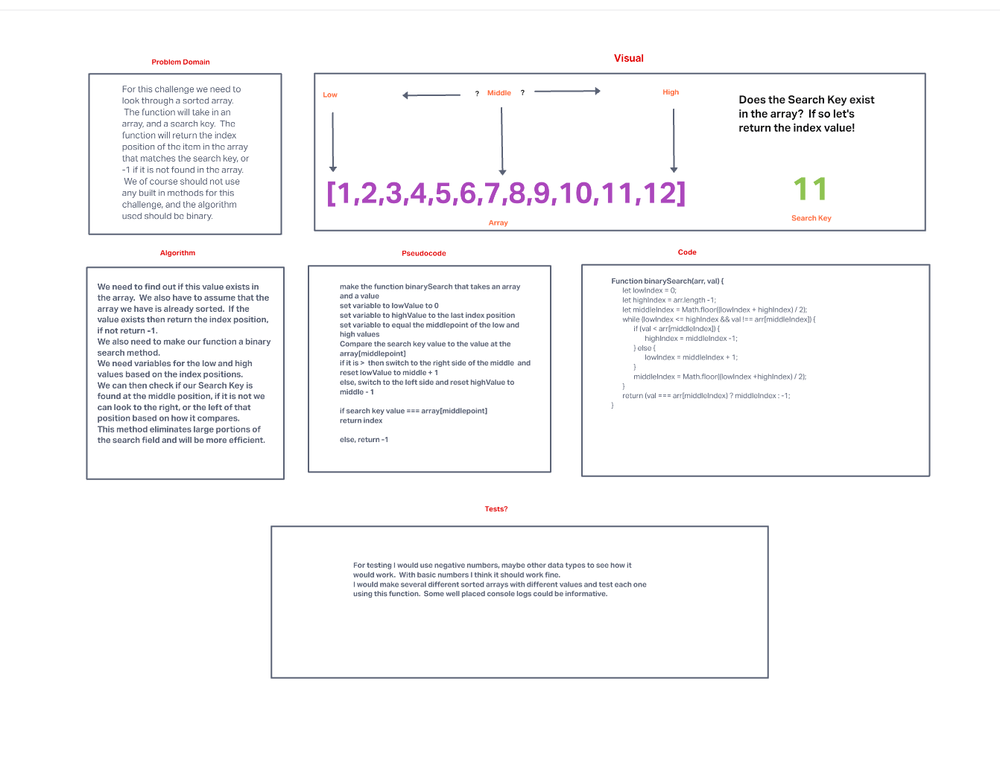

# Binary Search of Sorted Array

For this challenge we need to look through a sorted array.  The function will take in an array, and a search key.  The function will return the index position of the item in the array that matches the search key, or -1 if it is not found in the array.  We of course should not use any built in methods for this challenge, and the algorithm used should be binary.

## Whiteboard Process

## Approach & Efficiency

I had a bit of experience with this method already so I felt fairly comfortable with it.  I read the provided links and also did some research to refresh my memory before starting.  
I knew the basic algorithm and how it would work providing the array was already sorted.  I wonder if there is ever a case in a whiteboard interview where you would have to sort the array first?  If so, could you use a method for that?
The idea is that if the array is already sorted, you find the middle of the array and set that index position to a variable, much like I did in Code Challenge 02.  You then check to see if the value argument is equal to that array value, if so return that index position.  If the argument value is less than the middle value, then you reset the highIndex variable and start the search again, if it is greater, then you reset the lowIndex and start again.  Each time you also need to reset the middleIndex value.  
Using this method allows you to eliminate large portions of the search area and thus speed things up and make your search more efficient.  
I did need to change some of the placement of my variables to keep the loop from being infinite.

Another thing that was helpful, was that I just completed a Math 116 class at Seattle Central where we worked a lot with logarithmic functions! 

## Related Resources

[Wiki Binary Search Algorithms](https://en.wikipedia.org/wiki/Binary_search_algorithm)

[Khan Academy Article on Binary Search Algorithms](https://www.khanacademy.org/computing/computer-science/algorithms/binary-search/a/binary-search)