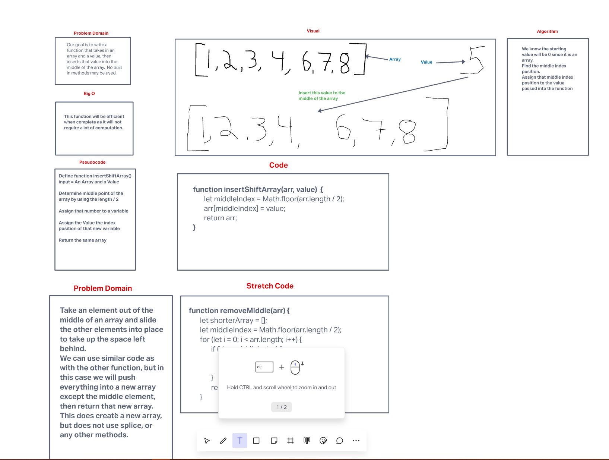

# Insert To The Middle Of An Array

Write a function that takes in array and a value, then adds the value to the middle of the array!

## Whiteboard Process

## Approach & Efficiency

I had a pretty good idea where I would start with this one.  I tested my code and it seemed to work ok. It is interesting as when I first see these challenges I know right away how I would do it if all my tools were available.  It is good practice to be forced to think of different ways to achieve the same result. 

I was able to get the stretch code working as well, though I don't know if using `.push()` was off limits?  Either way I am confident I could get that working better as well.  