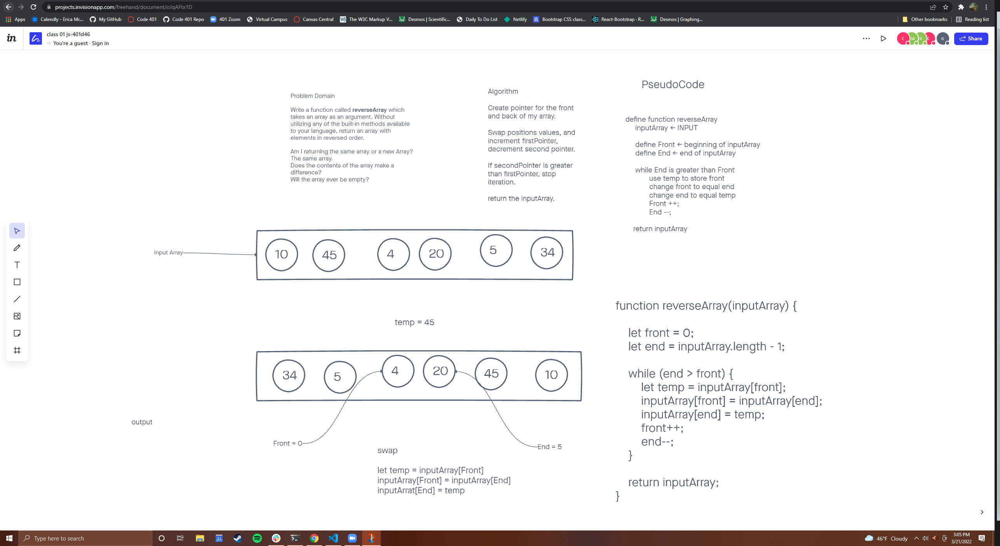
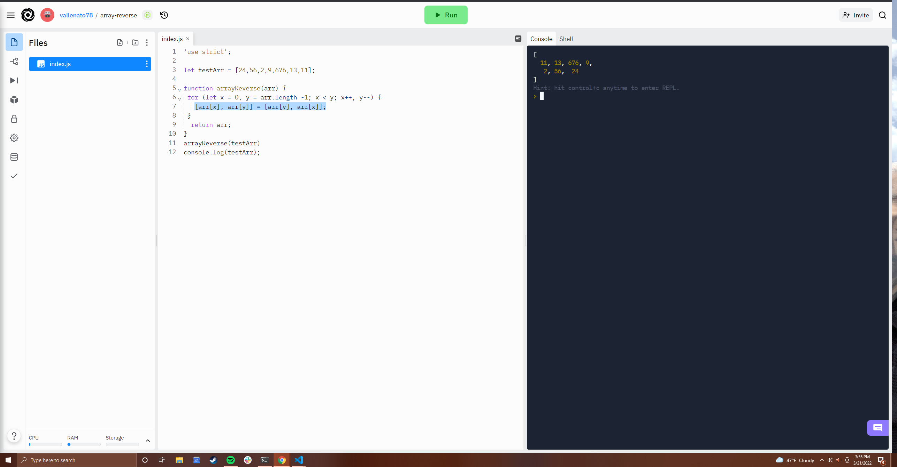

# Reverse an Array

For this challenge we were tasked to write a function that took in an array, then returned the same array but with the items reversed

## Whiteboard Process

I was wondering about a different way to write this code and found this cool solution by trincot on [Stack Overflow](https://stackoverflow.com/questions/45988670/reversing-an-array-without-reverse-or-duplicating-an-array)

I changed it slightly, but I do credit trincot for the solution.  

## Approach & Efficiency

This was a great introduction to the white board / coding challenges.  I appreciate going over it in class with Jacob as I feel that answered a lot of simple questions that I could have had.  I actually really enjoy challenges like these.  In my woodworking career, I would often challenge myself to build things with limited use of my power tools and with as few visible fasteners as possible, I view these challenges in the same way.