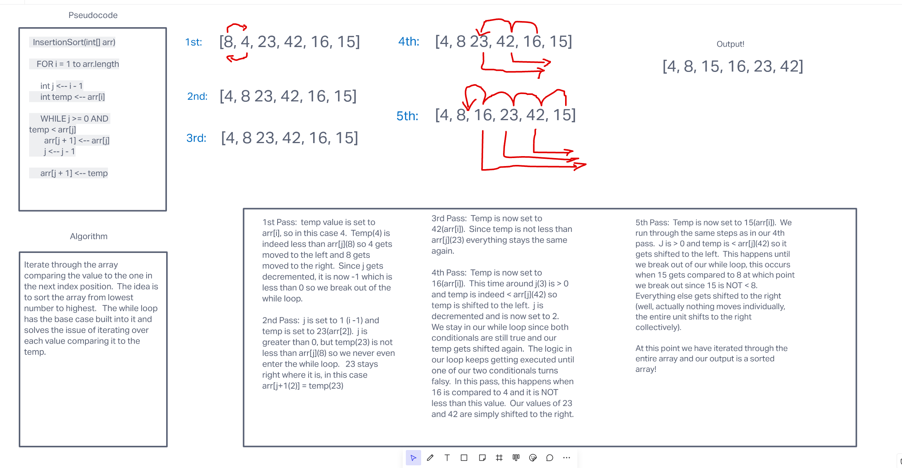

# Code Challenge 26 - Insertion Sort


## Problem Domain

For this challenge we are tasked with examining some pseudocode, then stepping through an algorithm that details each iteration of the sorting method in the function.  
After that, the challenge is to create a working and fully tested implementation of the code in the form of a `insertionSort()` function.

Pseudocode:

``` Java
  InsertionSort(int[] arr)

    FOR i = 1 to arr.length

      int j <-- i - 1
      int temp <-- arr[i]

      WHILE j >= 0 AND temp < arr[j]
        arr[j + 1] <-- arr[j]
        j <-- j - 1

      arr[j + 1] <-- temp
```

This [LINK](https://www.youtube.com/watch?v=waPQP2TDOGE) is also provided so that we may revisit the "Big O" efficiency of a function. 

For our algorithm we are to use the following sample array:

``` JavaScript
[8, 4, 23, 42, 16, 15]
```

Let's take a look at our pseudocode and break it down to see what is happening.

```Java
    InsertionSort(int[] arr)
```

It appears that our pseudo is written in `Java`.  This first line is where the `InsertionSort`function is declared and it takes in an array as an argument  

```Java
    FOR i = 1 to arr.length
```

This looks to start a basic for loop where i is set to 1 and the iteration count is the equal to the length of the array.

```Java
      int j <-- i - 1
      int temp <-- arr[i]
```

This looks to be where we declare two variables, `j`, and `temp` respectively.  `j` is set to `i` - 1, which at the start would be 0.  `temp` would be set to `arr[i]`.

```Java
      WHILE j >= 0 AND temp < arr[j]
              arr[j + 1] <-- arr[j]
              j <-- j - 1
```

Here it appears we will create a `while` loop with two conditional statements and if both are true, we will execute the code inside the loop.

```Java
    arr[j + 1] <-- temp
```

Finally, once we have broken out of the `while` loop, the value at position arr[j+1] gets set to the temp value.

## How does this apply to our code?


Let's take a look at our sample array:

``` JavaScript
[8, 4, 23, 42, 16, 15]
```

Now let's examine what happens when our code runs.
- Right off the bat we have our for loop, only this loop has the `i` variable set to 1.  
- Then, we declare a new variable, `j`, and set that to `i - 1`, so in this case that would be 0
- Temp is declared and given a value of `arr[i]`, in this case that would be 4
- Our conditional statemens in the `while` loop are examined.  For our first pass `j === 0` AND temp is less than `arr[j]`
```JavaScript
        4 < 8 === true;
```  
- Since both of these statements are true, the code within is executed, in this case that means that `arr[j+1] = arr[j]`

```JavaScript
    arr[j + 1] // This is index position 1, since j(0) + 1 === 1
    =
    arr[j] // This value is 8 in this case, since in the first pass the value at arr[0] is 8
```
- Then `j` is decremented and becomes -1, this then causes us to break out of our while loop
- And finally, `arr[j+1]` is given the value of temp, in this case that is 4

All of that happens in the first pass, and continues to fire off at each iteration through the first for loop.  If **BOTH** conditional statements in the `while` loop are deemed to be truthy, then that code is executed.  If that is not the case, then it skips the `while` loop and continues through and hits the next iteration.  

One thing to keep an eye on, is that bit where `j` is decremented.  Once the value at `j` is greater than 0, then it will decrement and each time the value will get shifted to the left.  Once temp is no longer less than arr[j] (or, j is less than 0) then the value at temp is inserted at that index position.  

## Check out this whiteboard for a visual representation of the algorithm and code



## Big O and Solution

The Big O efficiency for this function should be O(n^2) for time and O(1) for space

Working Solution in `JavaScript`:

```JavaScript
function insertionSort(arr) {
  for (let i = 1; i < arr.length; i++) {
    let j = i - 1;
    let temp = arr[i];
    while (j >= 0 && temp < arr[j] ) {
      arr[j + 1] = arr[j];
      j--;
    }
    arr[j + 1] = temp;
  }
  return arr;
}
```
