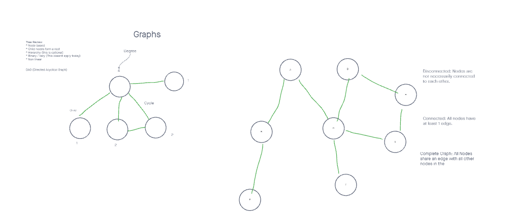
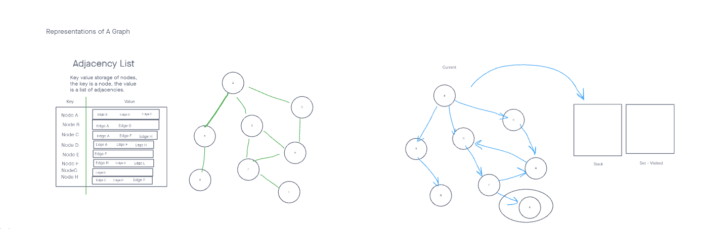
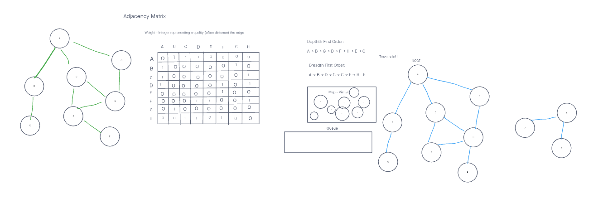

# Graphs







For this challenge we are tasked with implementing a new class, the `Graph` data structure.

## Challenge

- Add node
  - Arguments: value
  - Returns: The added node
  - Add a node to the graph

- Add edge
  - Arguments: 2 nodes to be connected by the edge, weight (optional)
  - Returns: nothing
  - Adds a new edge between two nodes in the graph
  - If specified, assign a weight to the edge
  - Both nodes should already be in the Graph

- Get nodes
  - Arguments: none
  - Returns all of the nodes in the graph as a collection (set, list, or similar)

- Get neighbors
  - Arguments: node
  - Returns a collection of edges connected to the given node
  - Include the weight of the connection in the returned collection
    size
  - Arguments: none
  - Returns the total number of nodes in the graph

## Approach & Efficiency

My approach will be to build off the work we did during lecture with Jacob and if necessary, do some further research online to learn more about the `Graph` class.

## Code Challenge 36

This challenge was to add the `breadthFirst` method to our `Graph` class.

- `breadthFirst`
  - Arguments: Node
  - Return: A collection of nodes in the order they were visited.

Based on the following Graph example:


The output should be:

[Pandora, Arendelle, Metroville, Monstroplolis, Narnia, Naboo]

Building off of the work done in class during lecture, here is my solution (credit to Jacob for getting us started)

```JavaScript
  breadthFirst(root, cb) {
    const queue = [root];
    const visited = new Set();
    let current = null;
    visited.add(root);
    while (queue.length) {
      current = queue.pop();
      if (cb) cb(current.value);
      const neighbors = this.getNeighbors(current);
      for (let edge of neighbors) {
        if (!visited.has(edge.vertex)) {
          visited.add(edge.vertex);
          queue.unshift(edge.vertex);
        }
      }
    }
    return visited;
  }
```

## Code Challenge 37

For this challenge we are tasked with creating a function called `businessTrip` that will return a boolean and $$ value based on if a "direct flight" trip is possible (and if true, the price of the flight) between two cities that get passed in as arguments.

## Challenge

- Write a function called business trip
- Arguments: graph, array of city names
- Return: cost or null

Based on this sample `Graph`:


Here are some possible outputs:


|Input | Output |
|------|--------|
|[Metroville, Pandora, ] |	True, $82|
|[Arendelle, New Monstropolis, Naboo] |	True, $115|
|[Naboo, Pandora]	 | False, $0|
|[Narnia, Arendelle, Naboo] |	False, $0|

## Solution

I am happy with my solution here.  Essentially I pass in:

- A `Graph`
- An array with two city names

Then, I get a list of edges based on the first city.  If the second city is included in that array of edges, then we return `true` + the cost of the flight. 
If not, then we return `false` + $0

Here is my solution:

```JavaScript
  const businessTrip = (graph, cities) => {
    // If the graph is empty, break out and return this message
    if (!graph.neighborList.size) {
      return 'Your Graph Is Empty';
    }
    // This gets the edges from the first city.
    let cityRoutes = graph.neighborList.get(cities[0]);
    // If the second city exists in the edges, return true plus the cost of the flight
    if (cityRoutes) { // If cityRoutes is empty, or falsy, we go straight to the false statement.
      for (let route of cityRoutes) {
        if (route.vertex.value === cities[1].value) {
          return [true, `$${route.weight}`];
        }
      }
    }
    return [false, '$0'];
  };
```

## Code Challenge 38 - `depthFirst`

## Challenge

- Write the following method for the Graph class:

  - Name: Depth first
  - Arguments: Node (Starting point of search)
  - Return: A collection of nodes in their pre-order depth-first traversal order
  - Program output: Display the collection

Given the following input:


The ouput would look this:

[ A, B, C, G, D, E, H, F ]

## Solution

Here is my working solution.  You can see that the main difference between `breadthFirst` and `depthFirst` is how the items get added and removed from the array (ie, using a stack vs a queue):

```JavaScript
    depthFirst(root, cb) {
    const stack = [root];
    const visited = new Set();
    visited.add(root);
    let current = null;
    while (stack.length) {
      current = stack.pop();
      if (cb) cb(current.value);
      const neighbors = this.getNeighbors(current);
      for (let edge of neighbors) {
        if (!visited.has(edge.vertex)) {
          visited.add(edge.vertex);
          stack.push(edge.vertex);
        }
      }
    }
    return visited;
  }
```
