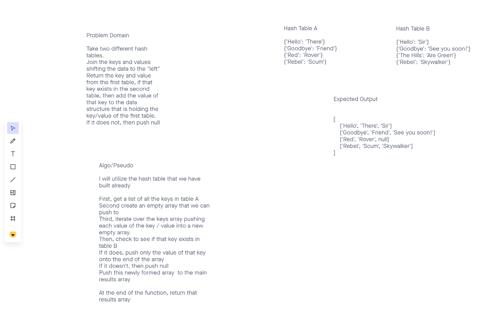
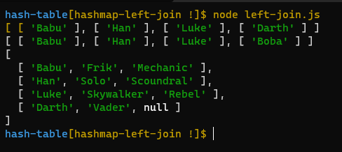

# Hashtables

For this challenge we are introduced to the Hash Table data structure.  I see this structure as an organized filing system.  With other data structures at times it can feel as if we are throwing things in with our eyes closed so to speak, then utilizing traversal methods to find things later.  

With the Hash Table structure things are done much more purposefully.  We store our data in a very specific place, so that we don't really have to "look" for it when we need it....we just go back to the exact place that we stored it, and it should be there!  
This is why I compare it to a filing system.  Just like with physical filing systems, things don't always work and there can be collisions which won't always break the table, but they do need to be dealt with. 

### Further Reading On Hast Tables

[Intro](https://codefellows.github.io/common_curriculum/data_structures_and_algorithms/Code_401/class-30/resources/Hashtables.html)

[Basics](https://www.hackerearth.com/practice/data-structures/hash-tables/basics-of-hash-tables/tutorial/)

[Wiki](https://en.wikipedia.org/wiki/Hash_table)

## Challenge

The challenge is to implement our own `HashTable` class that utilizes `Node` and `LinkedList` data structures to keep things organized. 
The methods we are going to create, and test for this challenge are:

- `hash`
  - "Hashes" the key that is provided as an argument.  This value provides the index postion
- `set`
  - Utilizing the hashed value of the key, this takes the key:value pair passed in as the argument and sets it in the table at the correct position
- `get`
  - Using the key, this method will retrieve the value, or key:value pair, if it exists in the hash table
- `contains`
  - This returns a boolean based on if the key exists in the table
- `keys`
  - This returns a list of the keys that are in the table

## Approach & Efficiency

My approach to this challenge was to build off what we did during class 30 with Ryan.  The Node and Linked List structures I am comfortable with.  The Hash Table logic seems very straight forward and useful actually.  Checking keys and values as they potentially become nested inside Linked Lists due to collisions is the only thing that could prove tricky.


## Code Challenge 31 - RepeatedWord function

The challenge today is to write a function that takes in a `string` as an argument and return the first repeated word.

### Approach

My approach to this challenge will be to split the string into an array first.  
Then, I will traverse that array, pushing each work into a new array.  
I will immediately begin comparing each word in the loop to see if it exists in the new array.  If it does, return the word.  If not, return "No Match Found"

Here is my solution, which so far has passed all tests:

```JavaScript
  const repeatedWord = (string) => {
  let stringyArray = string.toLowerCase().split(/\W+/);
  let array1 = [];
  for (let word of stringyArray) {
    if (array1.includes(word)) {
      return word;
    } else {
      array1.push(word);
    }
  }
  return 'No match found';
};
```
## Code Challenge 33 - `leftJoin`

The purpose of this function is to take in two hashmaps and return a new data structure.  This new structure will contain concatenated values if there is the same key in both hashmaps.


## Whiteboard


## Challenge

My strategy will be to:

1. Return a list of the keys from the first hashmap
2. Using this list, check to see if any of these keys exist in the 2nd hashmap
3. If they do, take the values from both keys and concatenate them into a single value made up of the key, the first value, the second value
4. It there is a key that only exists in the first hashmap, then return the concatenated value with `null` in the last place
5. This new data structure will most likely be an array.

## Solution

```JavaScript
  const leftJoin = (a, b) => {
  let joinedArray = [];
  let keys = a.keys();
  for (let key of keys) {
    let array = [];
    array.push(key[0]);
    array.push(a.get(key[0]));
    if (b.contains(key[0])) {
      array.push(b.get(key[0]));
    } else {
      array.push(null);
    }
    joinedArray.push(array);
  }
  return joinedArray;
};
```

Logged results from calling the function:

