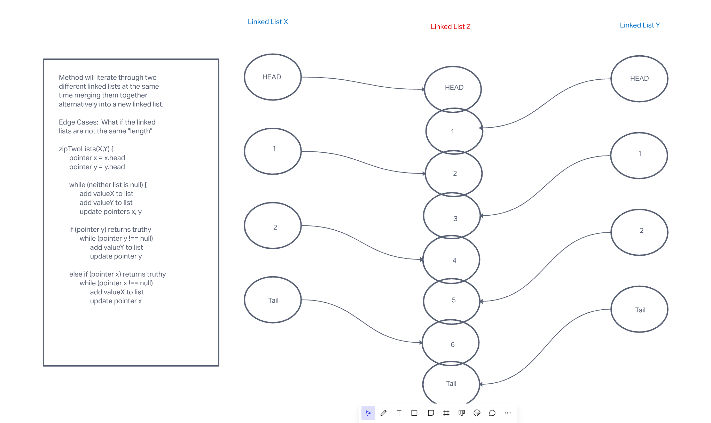

# Singly Linked List

This challenge is our first foray into the `linked list` data structure.  
We started off in class 05 with Jacob getting to know the basics of the linked list, and even started with a bit of code.  

## Challenge 05

This challenge is a continuation of the class 05 lecture and will include the following:

- Create the `insert` method
  - Arguments: `value`
  - Returns: `nothing`
  - Adds a new node with the passed `value` to the `HEAD` of the list with an O(1) time performance

- Create the `includes` method
  - Arguments: `value`
  - Returns: `boolean`
    - Indicates whther that value exists as a Node's value somewhere in the list

- Create the `toString` method
  - Arguments: none
  - Returns:  A string representing all the values in the Linked List formatted as: 
    > `"[a] -> [b] -> [c] -> NULL`

## Challenge 06

- Create the `append` method (I actually called this one `addsToTail`)
  - Arguments: `new value`
  - Adds a new node with the given `new value` to the end (tail) of the list

- Create the `insertBefore` method
  - Arguments: `value`, `new value`
  - Adds a new node with the given `new value` immediately _before_ the first node that has the `value` passed in

- Create the `insertAfter` method
  - Arguments: `value`, `new value`
  - Adds a new node with the given `new value` immediately _after_ the first node that has the `value` passed in

- Create the `deleteNode` method (Stretchy!)
  - Arguments: `value`
  - Finds a node in the list based on the `value` passed in, then deletes it

## Challenge 07

- Create the `kthFromEnd` method
  - Argument:  A number, `k`. as a parameter
  - Return the node's value that is `k` places from the tail of the linked list
  - You have access to the Node class and all the properties on the Linked List class as well as the methods created in previous challenges.

- Create the `middleNode` method (Stretchy!)
  - Argument:  None
  - Return the node's value that is in the middle of the linked list
  

## Challenge 08

- Create a function called `zipTwoLists`
  - Arguments: 2 linked lists
  - Return: New Linked List, zipped as noted below
  - Zip the two linked lists together into one so that the nodes alternate between the two lists and return a reference to the the zipped list.



## Approach & Efficiency
I went off the class lecture and then did a bit of research on my own.  The following 2 articles were particularly helpful:

[JS Linked List In 5 Easy Steps](https://sebhastian.com/linked-list-javascript/)

[Linked List Implementation in JavaScript](https://javascript.plainenglish.io/linked-list-implementation-in-javascript-ca0d3038f797)

For my `kthFromEnd` method I decided to utilize my `this.length` property that I implemented in the last lab.  I think it should make this challenge fairly straight forward.

For the `middleNode` I will be using similar logic as with the above method.
## Solutions

Here is a sample of the stretch goal for Challenge 06

``` JavaScript
 // finds a node based on the passed value and deletes it
  deleteNode(value) {
    if (this.head.value === value) {
      this.head = this.head.next;
    } else {
      let nodeBefore = this.head;
      let nodeCurrent = nodeBefore.next;
      while (nodeCurrent) {
        if (nodeCurrent.value === value) {
          nodeBefore.next = nodeCurrent.next;
          nodeCurrent = nodeCurrent.next;
          return value;
        } else {
          nodeBefore = nodeCurrent;
          nodeCurrent = nodeCurrent.next;
        }
      }
    }
  }
```

Using the `this.length` property I had already added, I was able to solve Challenge 07 like this:

``` JavaScript
// Returns a node's value that is "k" places from the end of the list.
  kthFromEnd(k) {
    let thisManyNodes = this.length - k;
    let nodeCounter = 0;
    let currentRef = this.head;
    if (k > this.length || k < 0) {
      return 'Invalid Number';
    }
    if (this.length === 1) {
      return this.head.value;
    } else {
      while (nodeCounter !== thisManyNodes) {
        currentRef = currentRef.next;
        nodeCounter++;
      }
      return currentRef.value;
    }
  }
```

I am quite happy with this solution to the merge lists challenge

```JavaScript
  zipTwoLists(listX, listY) {
    //sets the starting node reference
    let xCurrent = listX.head;
    let yCurrent = listY.head;
    // While neither list is null, add the values to the new list alternatively
    while (xCurrent !== null && yCurrent !== null) {

      this.addsToTail(xCurrent.value);
      this.addsToTail(yCurrent.value);
      xCurrent = xCurrent.next;
      yCurrent = yCurrent.next;
    }
    // if one list is longer and the algorithm breaks out of the while loop, add the rest of the values to the new list
    if (yCurrent) {
      while (yCurrent !== null) {
        this.addsToTail(yCurrent.value);
        yCurrent = yCurrent.next;
      }
    } else if (xCurrent) {
      while (xCurrent !== null) {
        this.addsToTail(xCurrent.value);
        xCurrent = xCurrent.next;
      }
    }
  }
```