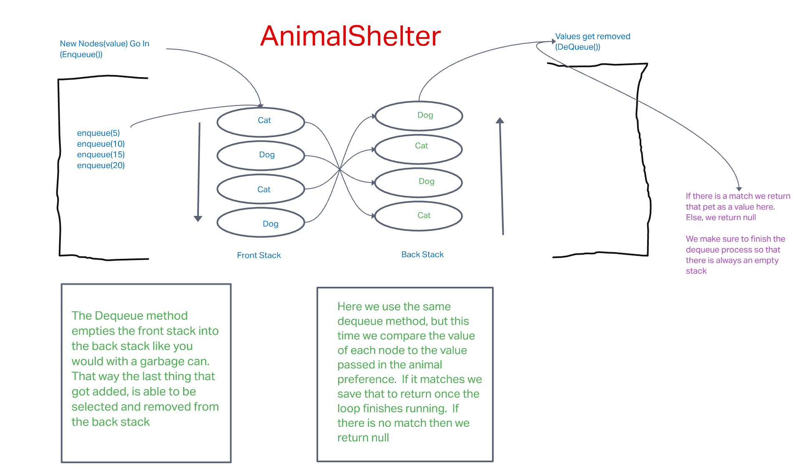

# AnimalShelter Class!

The challenge is to make a new `Class` of `AnimalShelter` which only holds cats and dogs.  

Create an `enqueue` method that adds a new pet to the shelter

Create a `dequeue` method that returns a pet based on a passed in animal preference as an argument. 

## Whiteboard



## Approach & Efficiency

I decided to build off the code I wrote yesterday with the `PseudoQueue`, only in the `dequeue` method each time we pop a value out of the back stack we stop to compare it to the `animal` argument that was passed in.  If it matches we save that as a variable to return, if it doesn't we push it back into the front stack.  If at the end there is no match we return null

## Solutions

Here is my solution to the `dequeue` method:

``` JavaScript
dequeue(animal) {
    let stackSize = this.frontStack.size;
    let correctAnimal;
    if (this.frontStack.size > 0) {
      for (let n = 0; n < stackSize; n++) {
        let poppedValue = this.frontStack.pop();
        this.backStack.push(poppedValue);
      }
      for (let a = 0; a < stackSize; a++) {
        let animalToCompare = this.backStack.pop();
        if (animal === animalToCompare) {
          correctAnimal = animalToCompare;
        } else {
          this.enqueue(animalToCompare);
        }
      }
      return (correctAnimal ? correctAnimal : null);
    }
  }
```