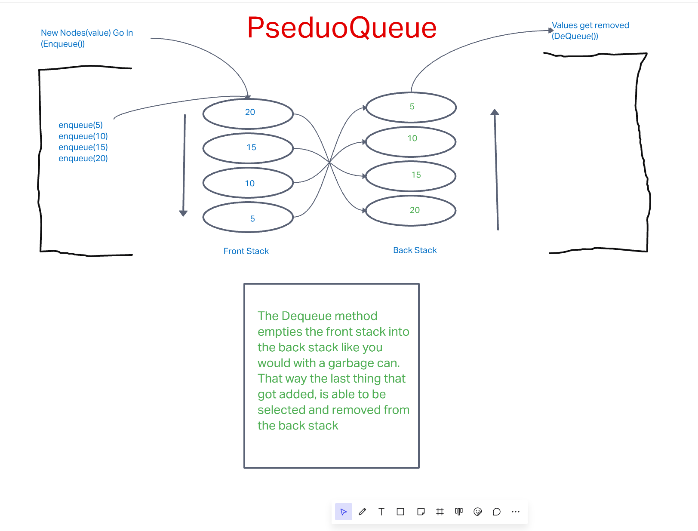

# Stacks and Queues, and also Pseudo Queues!

- Stacks and Queues are data structures that are similar to Linked Lists.  The main differences are:
  1. They operate under a `FILO` and `FIFO` order respectively
  2. Stacks use the **F**irst **I**n **L**ast **O**out (`FILO`), and Queues use the **F**irst **I**n **F**irst **O**out (`FIFO`)
  3. Stacks store their data vertically, or rather that is how I like to envision them (like stacks of pancakes!)
  4. Queues store their data horizontally (like people waiting in a queue!)

## Challenge



### Code Challenge 11

For this challenge we were asked to make a brand new Queue class, this time called the `PseudoQueue` class.  This particular queue is tasked with instantiating two `Stacks` inside that will be in charge of organizing the incoming, and outgoing data.  The logic will stay the same with the stacks, and it will essentially also stay the same in the Queue, but it will pass through the stacks.  

- Create a new class called `PseudoQueue`
  - Do not use an existing Queue.
  - Instead, this PseudoQueue class will implement our standard   queue interface (the two methods listed below),
  - Internally, utilize 2 `Stack` instances to create and manage the queue

- Create the `enqueue` method
  - Arguments: `value`
  - Inserts a `value` into the PseudoQueue, using a FIFO approach

- Creat the `dequeue` method
  - Arguments: none
  - Removes a value from the PseudoQueue using a FIFO approach

- Note: The `Stack` instances have only `push`, `pop`, and `peek` methods. You should use your own Stack implementation. Instantiate these Stack objects in your PseudoQueue constructor.


## Approach & Solutions 

This code reverses the order of the stack, or rather it empties the front stack into the backstack, at which point we are able "Dequeue" that value while sticking with the FIFO method.

``` JavaScript
dequeue() {
    let stackSize = this.frontStack.size;
    if (this.frontStack.size > 0) {
      for (let n = 0; n < stackSize; n++) {
        let poppedValue = this.frontStack.pop();
        this.backStack.push(poppedValue);
        console.log(this.frontStack.size);
      }
    }
    return this.backStack.pop();
  }
```