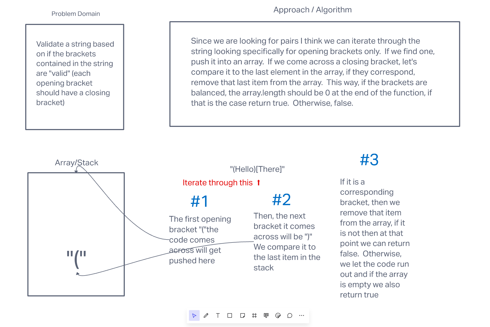

# Validate Brackets

The challenge here is to write a function that validates proper brackets in a string.

The function takes a `string` as an argument and returns true if there is proper bracket implementation, and false if it doesn't.  (Proper = each opening bracket needs the accompanying closing bracket)

## Whiteboard Process



## Approach & Efficiency

I had a good idea on how to start based on what we have done with queues so far.  I got the "rough draft" done fairly quickly, the tricky part was when different characters were introduced and what to do with them.  
Below you will find my solution.

## Solution

```JavaScript
function validateBrackets(string) {
  // Empty array that acts as our stack
  let stack = [];
  // string to be used for comparison
  let brackets = '({[]})';
  // Main loop to iterate through the entire string
  for (let i = 0; i < string.length; i++) {
    // Sets the value of the last bracket pushed to the array
    let lastBracket = stack[stack.length - 1];
    // If the loop comes across an opening bracket it gets pushed to the stack
    if (string[i] === '(' || string[i] === '[' || string[i] === '{') {
      stack.push(string[i]);
    // If the loop comes across a closing bracket it compares it to the last item in the stack, which should be an opening bracket.  If they are correct pairs then we remove that item from the array  
    } else if ((lastBracket === '(' && string[i] === ')')
      || (lastBracket === '[' && string[i] === ']')
      || (lastBracket === '{' && string[i] === '}')) {
      console.log(stack, string[i]);
      stack.pop();
    // This code checks to see if the value at [i] doesn't match ANY brackets, if that is the case we carry on.
    } else if (!brackets.includes(string[i])) {
      continue;
    // If none of the above happens, that means that the closing bracket does NOT match the opening bracket in the array and we can return false right here
    } else {
      return false;
    }
  }
  // If we make it this far, we can safely return true if the stack is empty, since that means that each opening bracket inside found it's match.
  return (stack.length === 0);
}
```