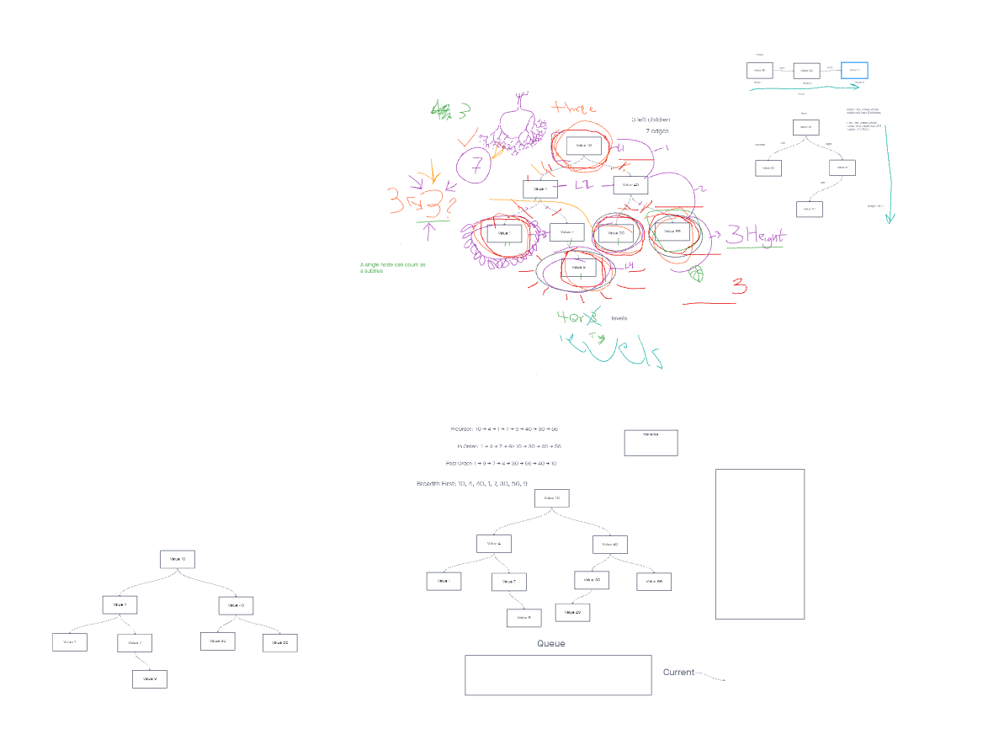

# Trees

This week's topic is the data structure `Trees`.  We will be learning about this data structure, how and when to use it, and how to write good code for it's implementation

## Challenge

**Challenge 15**
Per the class lecture, implement a `Node` class that will be used with our `Trees`.
Implement a `Binary Tree` Class and accompanying methods
Implement a `Binary Search Tree` Class and accompanying methods
Write passing tests for all classes and methods

**Challenge 16**

For this challenge we were tasked with creating a `getMax` method to the `BinaryTree` class. The purpose is to traverse a tree and return the max value.  

## Approach & Efficiency

My approach is to build off our class lecture and the code that Jacob started.  The binary search tree is essentially like a normal binary tree, just dividing the values based on their relative value to the root. 

I also used this article on [Medium](https://medium.com/swlh/binary-search-tree-in-javascript-31cb74d8263b) (author: Gulgina Arkin) for inspiration and to help further understand the algorithms behind the code.  

## API

- `Node` Class
- `BinaryTree` class
  - `preOrder` method
  - `inOrder` method
  - `postOrder` method
  - `getMax` method
- `BinarySearchTree` class
  - `add` method
  - `contains` method